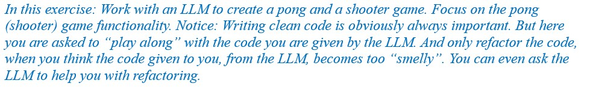
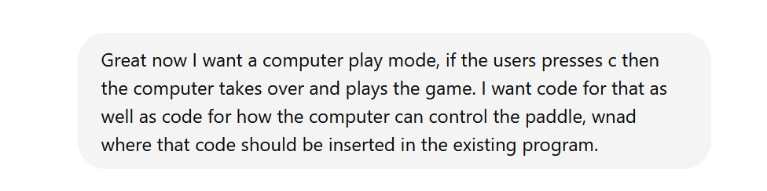
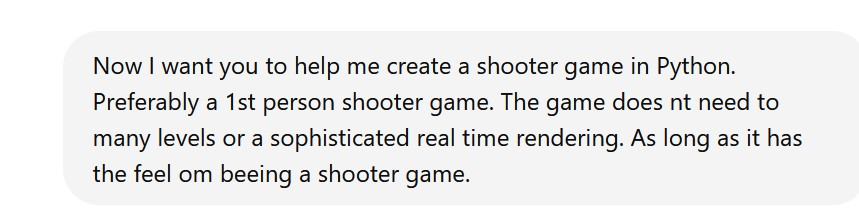
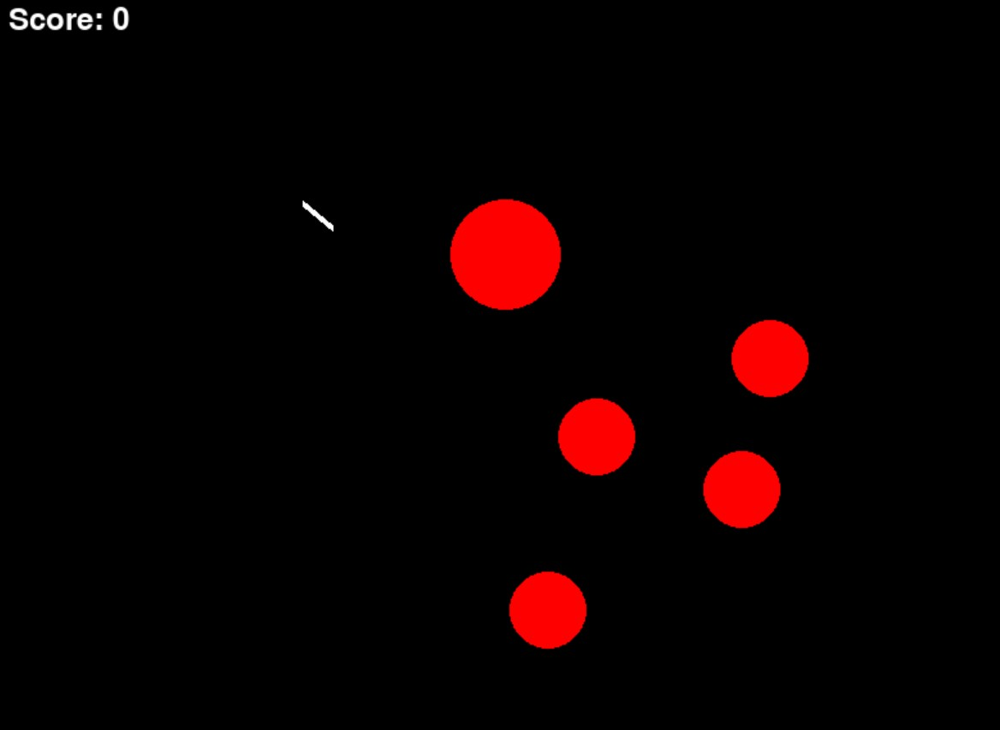

# Pong and Shooter game with help from an LLM
A pong and a shooter game in Python, with help from an LLM... 
 
 
 
I.e. After having previously worked on a Car game,  it is now time to work on (with a little help from ChatGPT)  a Pong and a Shooter game. 
 
So, here we go. We are going to create a Pong and a Shooter game with the help of an LLM  
(See the original exercise description <a href="PongAndShooterGameProgrammingWithLLM.pdf">here</a>). 
Exciting.
<h2>Exercise 1.</h2>
We begin chatting with ChatGPT (version ChatGPT o1-preview).
 
Apparently, that was an easy thing to do.  So, ChatGPT returns with code that works out of the box.  
 
Running the game (In its final version, see below, exercise 2),  it looks like this: 
 
The code is here: <a href="PongIntialVersion.py">PongIntialVersion.py</a>. 
<h2>Exercise 2.</h2>
Next, you should try to make a small change to the game.  
One possibility is to ask for a version with “self-play”,  where the computer also controls the bat.
 
Where the code runs after a few minor corrections.  
 
The code is here: <a href="PongSelfPlay.py">PongSelfPlay.py</a>. 
<h2>Exercise 3.</h2>
After the small changes to the Pong game (exercise 1 and 2),  
you can then move on to a shooter game.
 
The code returned from ChatGPT (sadly) initially crahes.  
But, after a few corrections,  it is also possible to make that code run. 
Well, well... 
 
The code is here: <a href="Shooter.py">Shooter.py</a>. 
<h2>Exercise 4.</h2>
So, is it all too easy to make small games like this? 
Maybe. 
 
Look at this study, that explores the impact of LLMs on human creativity: 
 <a href="https://techxplore.com/news/2024-10-explores-impact-llms-human-creativity.html" target="_blank">Study explores the impact of LLMs on human creativity</a>
and 
 <a href="https://arxiv.org/abs/2410.03703" target="_blank">Human Creativity in the Age of LLMs: Randomized Experiments on Divergent and Convergent Thinking</a>. 

 The authors argue that:
 <blockquote>
"However, there are growing concerns, which have not yet received sufficient attention, about the long-term impact of these tools on human creativity. We hypothesized that the repeated use of large language models (LLMs) might be impairing our ability to think creatively on our own, despite enhancing performance while the tool is in use—similar to the temporary boost provided by performance-enhancing steroids in sports."</blockquote>

Indeed:
 <blockquote>
“The researchers found that across both experiments, the use of GPT-4o had improved the performance of participants during the exposure phase. Interestingly, however, participants who did not initially use GPT-4o were found to outperform participants who had access to the model during the test phase.”</blockquote>

<blockquote>“The researchers were also surprised to find that the previously reported homogenization effect (i.e., the reported tendency of LLM users to come up with less diverse ideas over time) persisted even after participants had stopped using GPT-4o.”</blockquote>

Indeed, "Let's be careful out there". 
It always takes a little thinking, even working with LLMs. 
Of course. 
 
Understanding the process you are in, the benefits and  disadvantages,  is always important, indeed. 

