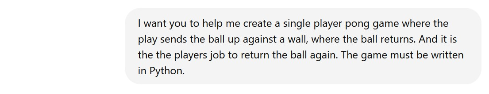
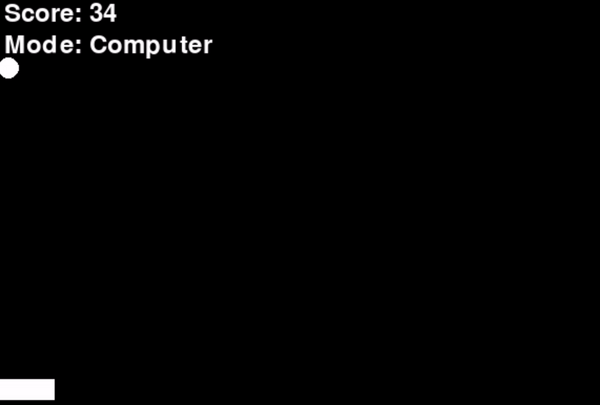

# Pong and Shooter game with help from an LLM
A pong and a shooter game in Python, with help from an LLM... 
 
 
 
I.e. After having previously worked on a Car game,  it is now time to work on (with a little help from ChatGPT)  a Pong and a Shooter game. 
 
So, here we go. We are going to create a car game with the help of an LLM  
(See the original exercise description <a href="PongAndShooterGameProgrammingWithLLM.pdf">here</a>). 
Exciting.
<h2>Exercise 1.</h2>
We begin chatting with ChatGPT (version ChatGPT o1-preview).
 
Apparently, that was an easy thing to do.  So, ChatGPT returns with code that works out of the box.  
 
Running the game (In its final version, see below, exercise 2),  it looks like this: 
 
The code is here: <a href="PongIntialVersion.py">PongIntialVersion.py</a>. 
<h2>Exercise 2.</h2>
Next, you should try to make a small change to the game.  
One possibility is to ask for a version with “self-play”,  where the computer also controls the bat.
 
Where the code runs after a few minor corrections.  
 
The code is here: <a href="PongSelfPlay.py">PongSelfPlay.py</a>. 
<h2>Exercise 3.</h2>
After the small changes to the Pong game (exercise 1 and 2),  
you can then move on to a shooter game.
 
The code returned from ChatGPT (sadly) initially crahes.  
But, after a few minor corrections,  it is also possible to make that code run. 
So, not that bad. 
 
The code is here: <a href="Shooter.py">Shooter.py</a>. 

